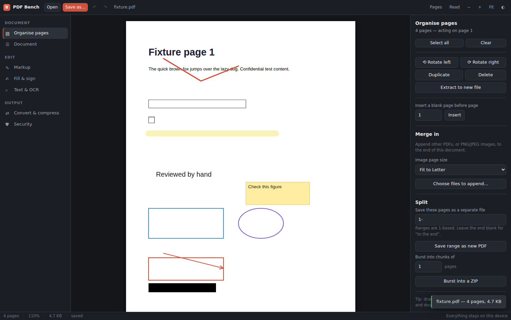

# PDF Bench

A free, offline PDF workbench. Organise, mark up, fill, sign, redact, OCR,
convert, compress and encrypt PDFs — on your own machine, with no account, no
subscription and no upload.

It ships as a Windows desktop application, and the same code also runs as a
plain web page you can host anywhere.



---

## Why this exists

Most PDF work is routine: merge these, rotate that, sign here, black out a
line, shrink it enough to email. Paying a monthly subscription for that is
avoidable, and uploading a contract to a free web converter is worse. PDF Bench
does the work locally and gets out of the way.

**It is not a clone of Adobe Acrobat**, and it does not use Adobe's name, code
or interface. It is an independent MIT-licensed program that covers the jobs
people usually open Acrobat to do. There is an honest comparison further down,
including the things it cannot do.

---

## What it does

**Pages** — merge, split, burst into chunks, reorder by dragging, rotate,
delete, duplicate, extract, insert blanks. Multi-select with `Shift` and
`Ctrl`.

**Edit text** — click a line of text and retype it. The line is covered with a
patch matching the page background and the new text is set in a matching font,
size and colour. This is an overlay, not a re-flow of the original text (see
the comparison below), and the original is still in the file until you make the
edit permanent, which flattens just that page.

**Markup** — pen, highlighter, text boxes, sticky notes, rectangles, ellipses,
lines, arrows and redaction boxes. Everything stays selectable and editable
until you flatten it, then it is burned into the page content so every viewer
shows it identically. Rotated pages are handled correctly.

**Fill & sign** — detects interactive form fields and lets you fill them, then
flatten so the values become permanent. You can also *create* fields — text,
multi-line, checkbox and dropdown — turning a flat document into a fillable
form. Draw a signature with a mouse, pen or
touchscreen, or import one as an image; the white background is knocked out
automatically. Dated approval stamps included.

**Text & OCR** — search the whole document, extract plain text, and run OCR on
scanned pages. OCR produces a page that looks the same but carries an invisible
text layer, so it becomes searchable and selectable. The OCR engine and its
English training data are bundled inside the application; nothing is
downloaded.

**Compare** — check the open document against another version. Every page is
compared as an image (changes shown in red) and as text (lines added and
removed), and the differences can be saved as a PDF report.

**Document** — edit title, author, subject, keywords and creator; add
watermarks at any size, angle and opacity; add page numbers with a custom
format, position and starting number.

**Convert & compress** — PDF to PNG or JPEG at any resolution, PDF to plain
text, images to PDF, and two kinds of size reduction: a lossless re-save, or
rasterisation for the big wins.

**Security** — see below; this is the part worth reading carefully.

---

## Security, described accurately

Security claims deserve precision, so here is exactly what is and is not true.

### What the application guarantees

**Your documents never leave the machine.** In the desktop build this is not a
promise, it is enforced: the Electron shell blocks every outbound network
request at the session level. There is no telemetry, no update check, no font
CDN, no analytics. If a dependency ever tried to send something, the request
would be refused by the shell and logged to the console. You can verify this by
running the app with a network monitor attached, or by reading
`electron/main.cjs` — it is about 250 lines.

**The interface cannot touch your filesystem.** The renderer process is
sandboxed and context-isolated with Node integration off. It talks to the
operating system through exactly four functions (`electron/preload.cjs`), and
both file functions open a native dialog that you must confirm. A bug — or a
malicious PDF — cannot make the page read or write a path of its own choosing.

**Everything is served from the app itself.** The UI loads over a custom
`app://` protocol, confined to the packaged application directory, under a
strict Content-Security-Policy that forbids remote scripts, inline scripts,
frames and objects. Navigation away from the app, pop-up windows and every
permission request are refused.

### What it does to documents

**AES-256 encryption.** Set a *user password* (needed to open the file at all)
and/or an *owner password* (needed to change permissions). This is real
cryptography: without the user password the content cannot be read.

**Permission flags** — printing, copying, editing, form filling, assembly and
so on. Be clear-eyed about these: PDF permissions are honoured by viewers *by
agreement*. They are not enforced by encryption, and a viewer that chooses to
ignore them can. That is a property of the PDF specification, not of this
program. If content must not be readable, use a user password.

**Active-content scanning and stripping.** PDFs can carry JavaScript, actions
that run on open, launch actions that start programs, form submissions to
remote servers, attached files and embedded media. That is how PDFs get used to
deliver malware. PDF Bench can list everything of that kind in a file, and
remove it while leaving text, images and page links untouched. Worth running on
anything you receive, and on anything you send.

**True redaction.** A black box drawn over text still has the text underneath
it, and anyone can select and copy it — this is the single most common way
redactions fail in the real world. PDF Bench draws the boxes, then flattens the pages that
carry them (or every page, if you ask) so the covered content genuinely stops
existing. Pages without redactions keep their selectable text. It tells you
plainly what the flattening costs: selectable text, form fields and bookmarks
on those pages. The same step makes edited text permanent.

**SHA-256 fingerprinting.** Hash exactly what you are about to send, so the
recipient can prove the file did not change in transit.

### What it does not claim

- **No software is unhackable.** Anyone who tells you otherwise is selling
  something. What this design does is remove whole categories of risk — there
  is no server to breach, no account to phish, no network path out, and no
  filesystem access from the part of the app that parses untrusted files.
- **It does not sign documents with a certificate.** Cryptographic signatures
  that a viewer validates against a certificate authority are not implemented.
  The signature feature places an image of your handwritten signature, which is
  what most workflows actually ask for, but it is not a digital certificate.
- **Encryption is only as good as your password.** There is no recovery. A
  strength meter is shown while you type; take it seriously.
- **It does not protect against a compromised machine.** If something is
  already running on your computer with your privileges, no document tool can
  help you.

---

## Honest comparison with Adobe Acrobat Pro

| Task | PDF Bench | Acrobat Pro |
| --- | --- | --- |
| Merge, split, reorder, rotate, extract | Yes | Yes |
| Annotate, highlight, comment | Yes | Yes, plus shared review workflows |
| Fill forms and flatten | Yes | Yes |
| Create new interactive form fields | Yes — text, multi-line, checkbox, dropdown | Yes |
| Handwritten signature placement | Yes | Yes |
| Certificate-based digital signatures | No | Yes |
| Edit existing body text in place | Partly — click a line and retype; an overlay, not a re-flow | Yes, with true re-flow |
| OCR | Yes, bundled and offline | Yes |
| Redaction | Yes, with genuine content removal | Yes |
| Password protection, AES-256 | Yes | Yes |
| Strip scripts and attachments | Yes | Partial |
| Word/Excel/PowerPoint conversion | No | Yes |
| PDF/A validation and conversion | No | Yes |
| Compare two documents | Yes — pixel and text diff, with a PDF report | Yes |
| Cost | Free, MIT licensed | Subscription |
| Works with no network at all | Yes, by design | Requires sign-in |

The honest gaps for most people are **true text re-flow** and **Office
conversion**. Edit text swaps a line for another in a matching font, which is
exactly right for fixing a figure, a name or a date, but it does not re-wrap a
paragraph or re-justify the lines around it, and it can only match the standard
fonts (a custom typeface is substituted with the nearest of Helvetica, Times or
Courier). Properly re-flowing text means subsetting the original font, which is
a large piece of work. Office conversion needs a full document engine — if you
need it, LibreOffice does it well and is also free.

Two further limits worth knowing: text that is not horizontal on screen
(sideways text on a rotated page, or text set at an angle) cannot be selected
with Edit text, and a covered line stays in the file — selectable by anyone who
opens it — until you use *Make edits permanent*.

---

## Install

### Windows

Download `PDF Bench-<version>-x64.exe` from the
[Releases](../../releases) page and run it. It installs per-user, so it needs
no administrator rights.

Prefer not to install anything? Use `PDF Bench-<version>-portable.exe` — a
single file that runs from a USB stick and leaves nothing behind.

Windows SmartScreen will warn about an unrecognised publisher. That is expected
for software without a code-signing certificate (they cost a few hundred
dollars a year). Choose **More info → Run anyway**, or verify the SHA-256
published alongside the release first.

### Build it yourself

You need [Node.js](https://nodejs.org) 20 or newer.

```bash
git clone https://github.com/Bumble-bee-999/pdf-bench.git
cd pdf-bench
npm install
npm start          # run the desktop app
```

To produce the Windows installer and portable build:

```bash
npm run dist:win   # output lands in release/
```

On Windows you can just double-click `build-windows.bat`, which does all of the
above.

Cross-building the Windows installer from Linux or macOS also works, but needs
Wine installed. Building on Windows needs nothing extra.

### As a web page

The same application runs as a static site:

```bash
npm run build      # writes dist/
```

Upload `dist/` anywhere — GitHub Pages, Netlify, an internal file server. There
is no backend. Note that a hosted copy cannot make the "no network access"
guarantee the desktop build does, because a browser tab can always reach the
network; the code still never sends anything.

---

## How it is put together

```
src/
  core/
    store.js       document state, undo/redo history
    app.js         load, mutate, reload, export lifecycle
    pdfops.js      every document mutation (pdf-lib)
    security.js    encryption, sanitising, hashing
    render.js      page rasterisation and text extraction (pdf.js)
    geometry.js    visual ↔ PDF coordinate transforms, incl. page rotation
    compare.js     page-by-page pixel and text diff
    ocr.js         offline OCR pipeline
  ui/
    reader.js      page view and live markup overlay
    organizer.js   thumbnail grid, drag reordering
    panels/        one module per tool
electron/
  main.cjs         desktop shell and its security policy
  preload.cjs      the entire renderer→OS bridge, four functions
```

The single source of truth is the current PDF as a byte array. Every operation
takes bytes and returns new bytes, which makes undo a matter of keeping the
previous array and makes each operation independently testable.

Markup is kept as vector objects in visual coordinates and drawn on a canvas
overlay, then burned into the page content stream on export. `geometry.js`
handles the awkward part — a page with `/Rotate 90` displays rotated but stores
its content unrotated, so every coordinate has to be mapped back.

## Tests

```bash
npm run dev &       # the tests import source modules, so they use the dev server
npm test            # 70+ checks: every operation, text editing, form fields, comparison
npm run test:ocr    # OCR with all external requests blocked
npm run test:desktop # boots the Electron shell and screenshots it
```

The tests drive a real browser. They open a fixture PDF, run each operation,
burn markup and form fields into both an upright and a rotated page and then
read the result back to confirm each landed where it was drawn, click through
the Edit-text and Text tools the way a person would, encrypt, sanitise,
rasterise, compare two versions through the real file chooser, and OCR with the
network blocked.

## Contributing

Issues and pull requests are welcome. Useful places to start: certificate-based
signing, true text re-flow, editing existing form fields (name, options,
tab order), and more OCR languages (drop a `.traineddata.gz` into `public/ocr/lang/` and it appears in
the dropdown automatically).

## Licence

MIT — see [LICENSE](LICENSE). Use it, change it, ship it, sell it. Third-party
components and their licences are listed in [THIRD-PARTY.md](THIRD-PARTY.md).
